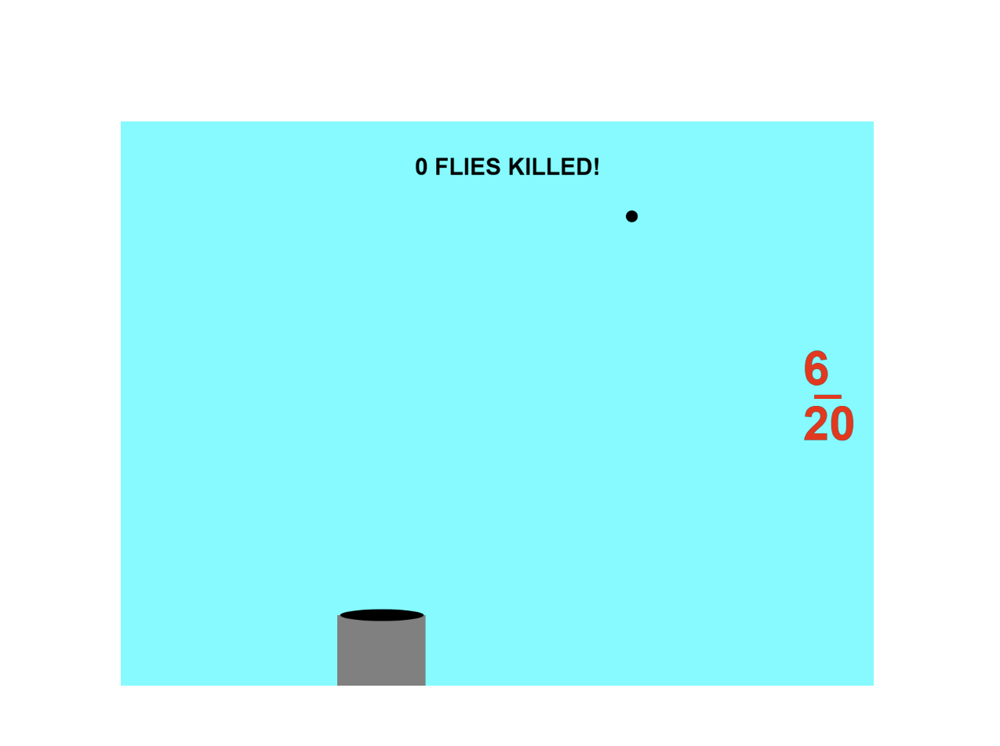
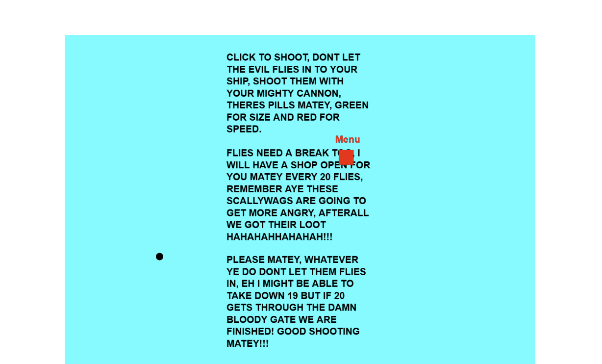

# Mod-Jam

Kai Maquivar and Pippin Barr

[View this project online](https://kaim-bit.github.io/cart253/topics/Mod-Jam/frogfrogfrog)

## Description

> this modjam is a modded version of Pippin Barr's frogfrogfrog game, a simple frog rougelike were flies get faster each wave, you shoot down flies, eat pills and upgrade your stats, you try to last as long as possible.

## Screenshot(s)

> 
> 
> 
> 

## Attribution

This bit should attribute any code, assets or other elements used taken from other sources. For example:

> - This project uses [p5.js](https://p5js.org).
> - this projects sounds are both from pixibay, https://pixabay.com/sound-effects/metal-hit-sound-effect-241374 and https://pixabay.com/sound-effects/powerful-cannon-shot-352459
## License

> This project is licensed under a Creative Commons Attribution ([CC BY 4.0](https://creativecommons.org/licenses/by/4.0/deed.en)) license with the exception of libraries and other components with their own licenses.

