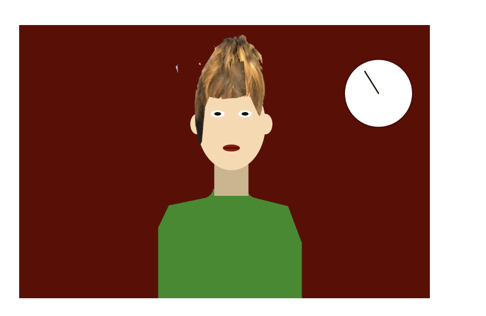

# Self Portrait

Kai Maquivar

[View this project online](https://kaim-bit.github.io/cart253/topics/art-jam/template-p5-project)

## Description

This is a weird self portrait of me, the main functions are the moving clock that gets faster over time and maxes out at a certain speed, the cursor can pick up the shirt and expose the ribcage, and the preloaded image hair

## Screenshot(s)

finished art jam image

> 

## New Functions

i have never used Function Preload() or image(), i used them for the really weird hair. I also used Cursor()

## Attribution

> - This project uses [p5.js](https://p5js.org).

## License

> This project is licensed under a Creative Commons Attribution ([CC BY 4.0](https://creativecommons.org/licenses/by/4.0/deed.en)) license with the exception of libraries and other components with their own licenses.

